# When AI Learns to Read a Spine

<p align="center">
  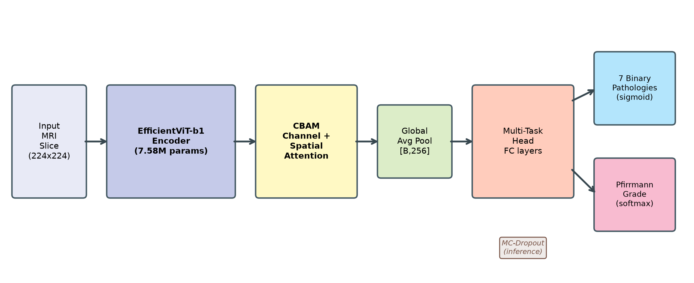
</p>

<p align="center">
  
  
  
  
</p>

> Can a 7.5M parameter model read a lumbar spine MRI as reliably as a radiologist — and tell you when it's unsure? This is that attempt.
>
> Built on the SPIDER benchmark (218 patients, 447 T1/T2 scans, 1515 discs). One shared encoder, two heads: 7 pathologies + 5-way Pfirrmann grading. With calibration so the confidence actually means something, and Grad-CAMs so you can see where it's looking.
>
> **Paper:** `Trustworthy_Spine_MRI_Conference_Paper_final.docx` (IEEE 2-column, final with figures)

---

## Overview

<table>
<tr>
<td width="50%">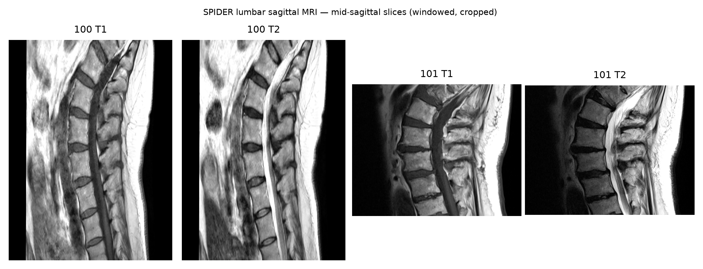<br><sub><b>SPIDER</b> — real T1/T2 sagittal scan (mid-sagittal slice)</sub></td>
<td width="50%">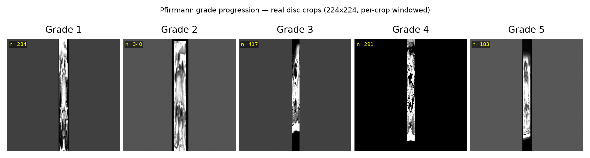<br><sub><b>Pfirrmann I→V</b> — 224×224 disc crops showing degeneration</sub></td>
</tr>
</table>

<table>
<tr>
<td width="50%">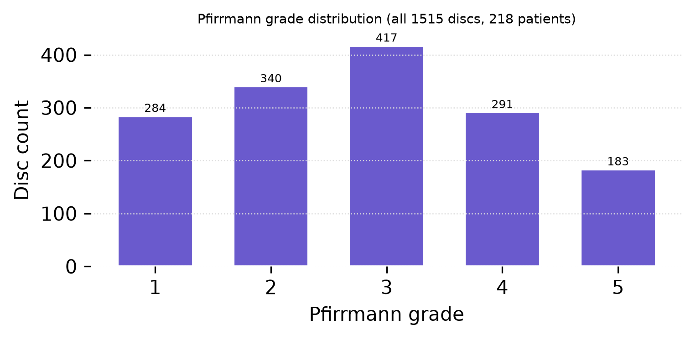<br><sub>Label distribution (1515 discs) — 7 pathologies + Pfirrmann</sub></td>
<td width="50%">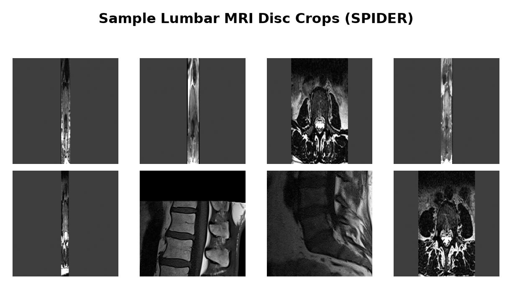<br><sub>Sample disc crops with gradings</sub></td>
</tr>
</table>

## Architecture

EfficientViT-b1 (7.58M) + CBAM → `[B,256,7,7]` → dual heads: 7× sigmoid (BCE, `pos_weight`) + 5-way CORN ordinal for Pfirrmann. ResNet-50 (23.53M) and MobileViT-S (4.94M) baselines, plus deep ensemble.

<p align="center">
  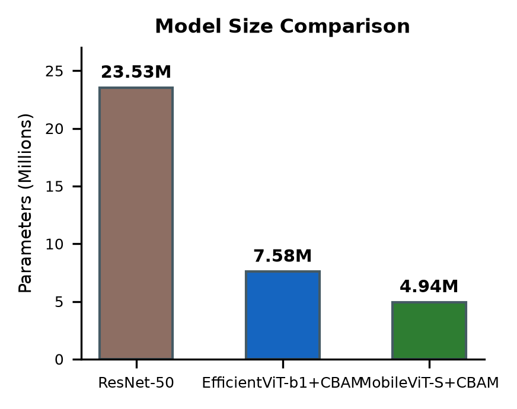
</p>

## Results

### Training & Discrimination

| Training (40 epochs, AdamW 3e-4 cosine) | Per-pathology AUC |
|---|---|
| 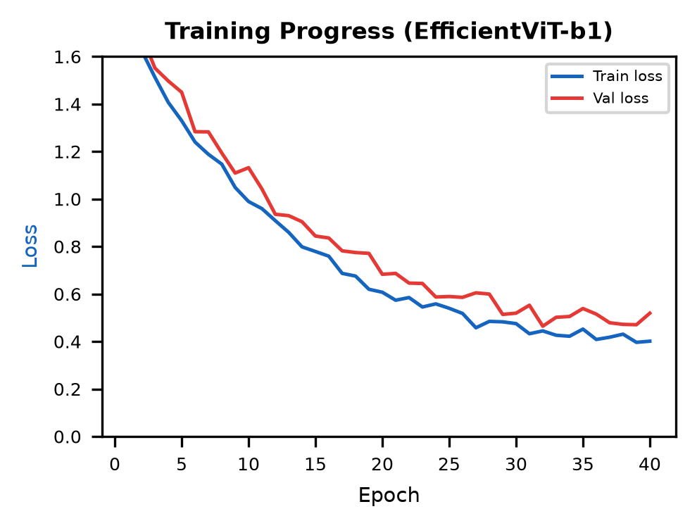 | 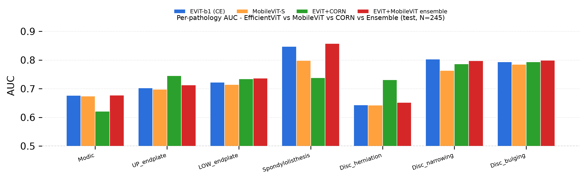 |

### Pfirrmann Grading

| Confusion — CE vs CORN | Error breakdown by grade |
|---|---|
| 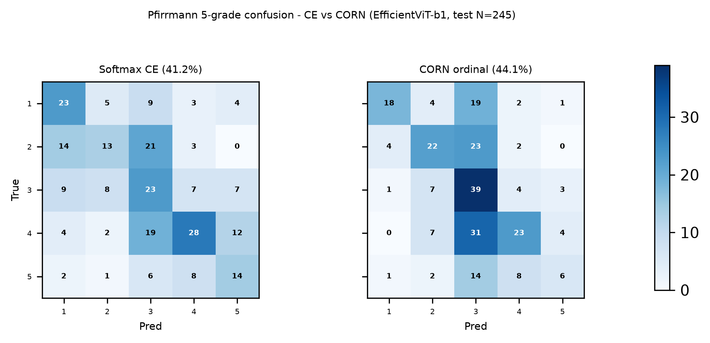 | 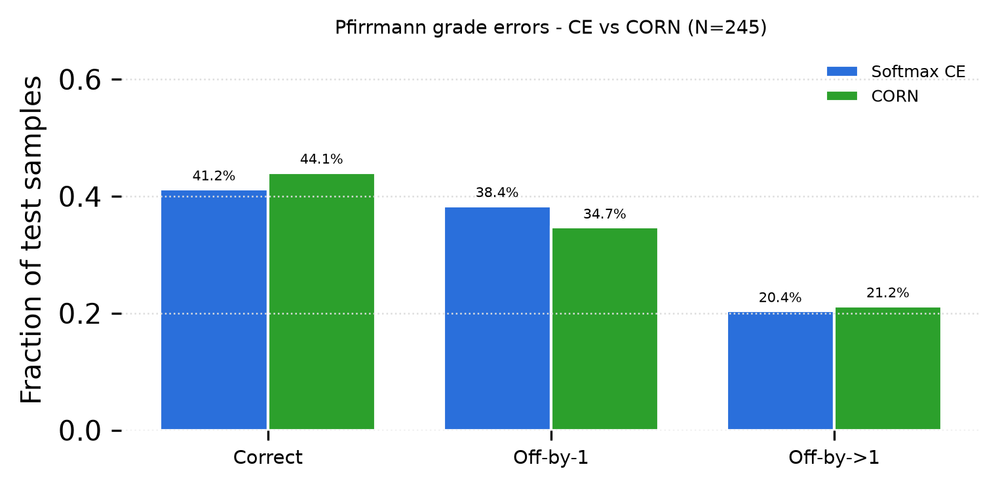 |

### Calibration & Reliability

<p align="center">
  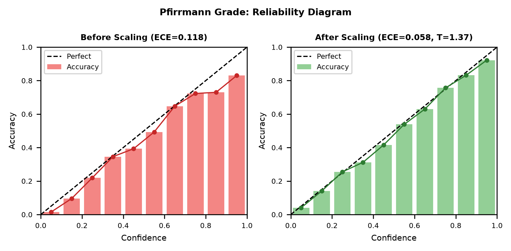
  <br><sub>Reliability diagram — ECE <b>0.118 → 0.058</b> after per-task temperature scaling (T=1.37, N=245)</sub>
</p>

### Cross-Validation & Ablation

| 5-Fold CV (patient-level, pooled 0.676±0.034) | CBAM Ablation |
|---|---|
| 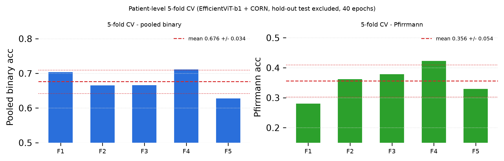 | 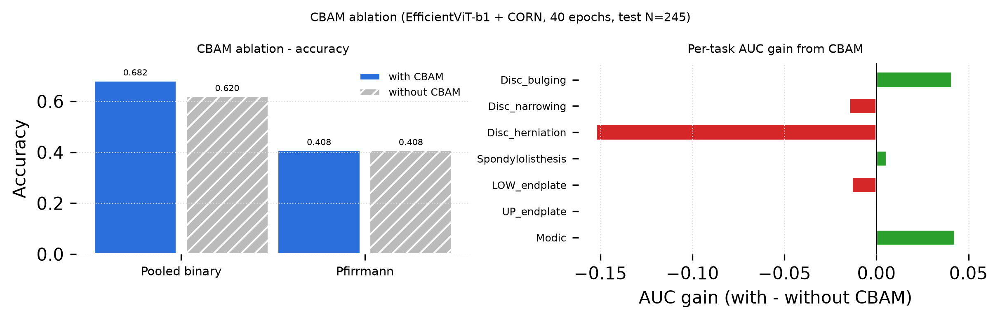 |

### Explainability (Grad-CAM)

<p align="center">
  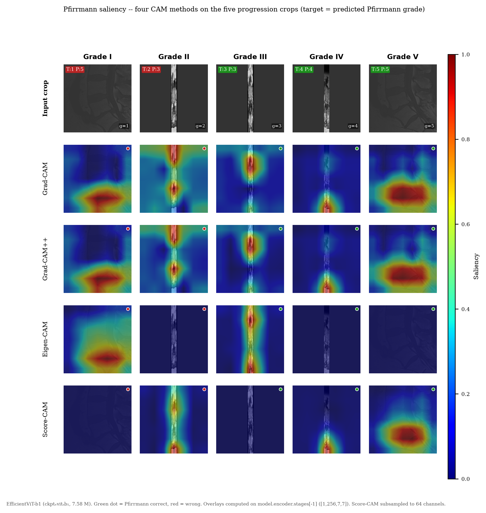
  <br><sub>Grad-CAM on <code>encoder.stages[-1]</code> — saliency progression Pfirrmann I→V (gradcam/gradcam++/eigencam/scorecam, target=7+pred)</sub>
</p>

<table>
<tr>
<td>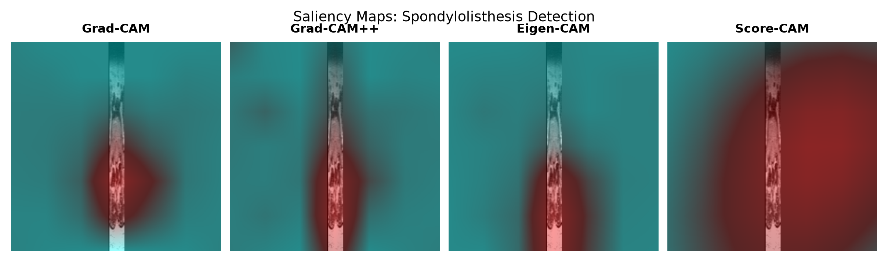</td>
<td>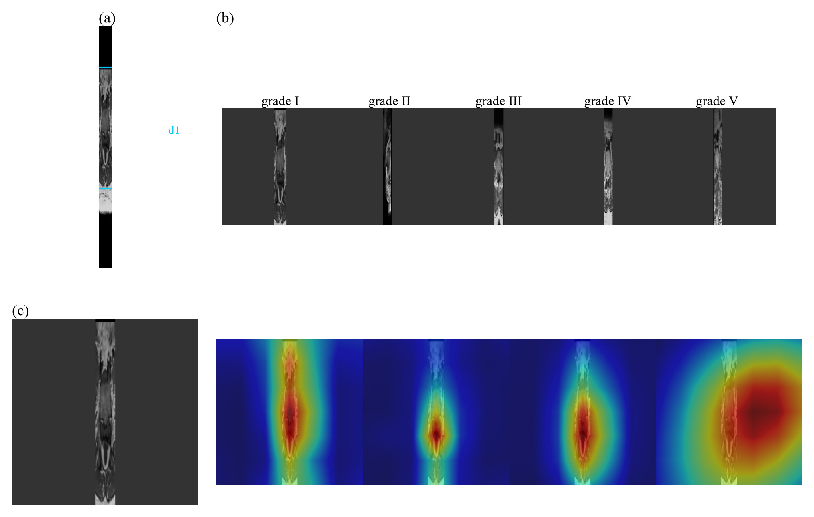</td>
</tr>
</table>

---

## Setup

```bash
python -m venv .venv
source .venv/bin/activate  # Windows: .venv\Scripts\activate
pip install -r requirements.txt
```

If `requirements.txt` is missing:

```bash
pip install torch torchvision timm SimpleITK scikit-learn matplotlib seaborn pandas scipy pillow python-docx
```

## Data

SPIDER (218 patients, 447 T1/T2 sagittal scans, 1515 discs) is **not** tracked in git — download separately:

- SPIDER official: https://spider.grand-challenge.org/ (images + masks)
- After download: `python prepare_dataset.py` → `python extract_disc_crops.py` to generate `crops/` (224×224 disc crops + `labels.csv`).

Expected layout:

```
crops/
  labels.csv
  crops_train/
  crops_val/
  crops_test/
```

> Large files (`crops/`, `images.zip` 3.7G, `*.pth` checkpoints, `results/`) are gitignored — see `.gitignore`. Add your Drive link here after upload if needed.

## Training

```bash
# Main model: EfficientViT-b1 + CBAM + CORN — ~40 epochs
python train_efficientvit.py

# Baseline
python baseline_train_resnet50.py
```

## Evaluation

```bash
python evaluate_baseline.py
python eval_tta_uncertainty.py        # TTA uncertainty
python eval_ensemble_uncertainty.py   # Deep ensemble
python calibrate.py                   # temperature scaling (ECE / reliability)
python tta_analysis.py
```

## Figures

```bash
# Regenerate all paper figures (Colab-friendly)
# Open COLAB_REGENERATE_ALL_FIGURES.ipynb in Colab and run all cells
# Or locally:
python gen_paper_figures.py
python improved_experiments.py   # CV / ablation / AUC comparisons
python gen_cam_progression.py    # 5×5 CAM grid (needs checkpoint)
```

Outputs: `figures/` and `figures_improved/` (tracked).

## Paper

Source: `Trustworthy_Spine_MRI_Conference_Paper_final.docx`

Recreate DOCX programmatically (optional):

```bash
python make_ieee_final3.py
python rebuild_paper.py
python fill_paper.py
```

## Colab

- `COLAB_REGENERATE_ALL_FIGURES.ipynb` — single `pip install` cell, copy-paste friendly
- `COLAB_REGENERATE_ALL_FIGURES_CELLS.md` — same cells as markdown
- `COLAB_INSTRUCTIONS.md` — step-by-step Drive mount flow

## Cite

If you use this work, please cite:

> Srishreyan S, Mohammed Ashlab, Gayathri Devi. *A Lightweight, Well-Calibrated Multi-Task Framework for Trustworthy Lumbar Spine MRI Diagnosis with Uncertainty and Explainability.* 2026. GitHub: https://github.com/Srishreyan/lumbar-MRI-diagnosis

Also cite SPIDER: van der Graaf et al., SPIDER — Spine Pathology and Intervertebral Discs Dataset. https://spider.grand-challenge.org/

```bibtex
@software{srishreyan2026lumbar,
  title  = {A Lightweight, Well-Calibrated Multi-Task Framework for Trustworthy Lumbar Spine MRI Diagnosis with Uncertainty and Explainability},
  author = {Srishreyan S and Mohammed Ashlab and Gayathri Devi},
  year   = {2026},
  url    = {https://github.com/Srishreyan/lumbar-MRI-diagnosis}
}
```

